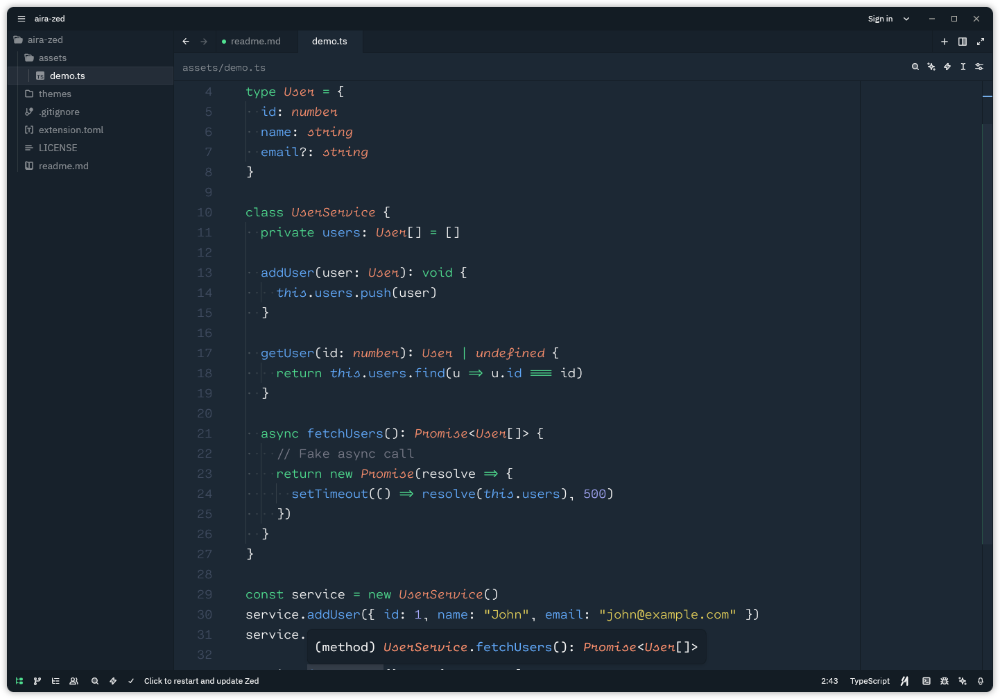

#  Aira Theme for Zed

Aira is a **clean, modern, and comfortable theme** for the [Zed](https://zed.dev) text editor — designed to enhance focus and readability for long coding sessions.

---

## 🖼️ Preview



---

## ✨ Features

- Minimal and balanced color palette
- Syntax highlighting optimized for readability
- Supports multiple programming languages
- Subtle UI elements that stay out of your way
- Comfortable contrast ratios for extended use

## ⚙️ Installation

### Manual Installation

1. Clone this repository or download the theme file
2. Copy the `themes` directory into your Zed configuration folder:

   **macOS / Linux**
   ```bash
   ~/.config/zed/themes/
   ```

   **Windows**
    ```bash
    %APPDATA%\Zed\themes\
    ```
3. Restart Zed
4. Select the Aira theme from the theme dropdown in the settings
(or use the keyboard shortcut `Ctrl + Shift + P` and type `theme`)
5. Enjoy!

## 🤝 Contributing

Contributions are always welcome!
If you’d like to improve the theme or fix an issue, feel free to open a Pull Request.

## 📄 License

This project is licensed under the [MIT License](LICENSE).
